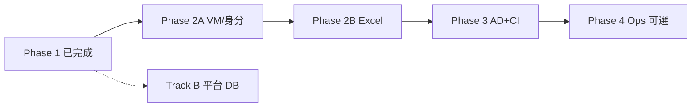

# Helpdesk DDP — 後續開發計劃（Roadmap）

> **For agentic workers:** 依任務順序實作；每完成一個 Phase 更新 [`specs/2026-06-02-helpdesk-backlog.md`](../specs/2026-06-02-helpdesk-backlog.md) 與 [`docs/PROGRESS.md`](../../PROGRESS.md)。  
> **需求 ID**：見 backlog §2。

**Goal：** 在 **Phase 1 已確認完成**（見 [`plans/2026-06-02-phase-2-todo.md`](2026-06-02-phase-2-todo.md) §Phase 1）基礎上，執行 **Phase 2A → 2B**；Phase 3+ 與 Track B 另列。

**目前有效 To-Do：** [`plans/2026-06-02-phase-2-todo.md`](2026-06-02-phase-2-todo.md) ← 勾選此檔即可。

**Architecture：** 延續 Vite middleware + `server/ddp` + `server/zentera` + `server/excel`；不引入前端打包 server 模組。

**Tech Stack：** TypeScript, Vue 3, Vitest, exceljs, ldapts, Playwright（取票）

---

## 總覽時程（建議）

| 階段 | 名稱 | 建議工期 | 依賴 |
|------|------|----------|------|
| — | Phase 1（已完成） | — | — |
| **2A** | VM 與身分規則 | 1–2 週 | D2 決策 |
| **2B** | Excel 延伸欄與測試 | 1 週 | 2A（Role/Application 依 VM） |
| **3** | AD 品質 + 工程底座 | 1 週 | 可與 2B 部分並行 |
| **4** | 舊流程營運（可選） | 0.5–1 週 | 營運確認 D4 |
| **B1** | 平台 DB 內容總表 | 2+ 週 | 獨立於 2A–4 |

---

## Phase 2A — VM 查詢鏈與申請人身分（P0）

**對應需求：** REQ-VM-001, REQ-ID-001, REQ-ID-002, REQ-EXL-002（決策）

**Goal：** Processed 與 Excel 使用同一套 VM 解析；申請人／requester 規則成文且可測。

### 交付物

- Spec 增補：`specs/2026-06-02-vm-lookup-and-identity.md`（實作前由 2A 產出，或合併進 backlog 決策表）
- `server/zentera/resolveVmHostnameFromManager.ts` 重構或新增 `resolveVmHostnameForApplicant.ts`
- `parseDdpTicket` / `resolveProcessedIdentity` 調整
- `tests/zenteraVmLookup.test.ts`、`tests/ddpParsing.test.ts` 擴充
- `docs/helpdesk-workflow.md` 更新 VM 說明

### 任務

- [ ] **2A.1 決策 D2**：用 1–3 筆真實工單對照 notebook 輸出，寫死查詢鏈（manager 是申請人的直屬主管）
- [ ] **2A.2 實作 VM 解析**：manager → manager 的 roles → applications → hostnames；保留 ambiguous 取字母序第一
- [ ] **2A.3 REQ-ID-001**：描述內申請人帳號提取；與 requester / LDAP 優先序
- [ ] **2A.4 REQ-EXL-002**：決策 D1 後，同步 `buildDdpExcelRows` 異常邏輯或更新 UI 說明
- [ ] **2A.5 回歸**：`pnpm test`；手動 Fetch+Enrich → Processed → Export Excel 抽樣

### 驗收

- [ ] 所有 VM 相關測試綠燈
- [ ] Processed `vmHostname` 與 Excel `VM HostName` 一致
- [ ] `docs/PROGRESS.md` 將 REQ-VM-001 標 ✅ 或 🟡

---

## Phase 2B — Excel 營運欄位（P1）

**對應需求：** REQ-EXL-001, REQ-EXL-003, REQ-EXL-004

**Goal：** 匯出檔可供維運直接使用 Role/Application；測試防止欄位回歸。

### 交付物

- `server/excel/enrichExcelRowFromZentera.ts`（或擴充 `buildDdpExcelRows`）
- `ProcessedDdpRow` 可選擴充 `role` / `application`（若 UI 也要顯示）
- `tests/exportDdpExcel.test.ts` + optional `tests/fixtures/export-golden.xlsx`
- `src/App.vue` Processed 表可選加 Role/Application 欄

### 任務

- [ ] **2B.1** 從 `ddp_analysis.ipynb` / `ddp_analysis_review.md` 抽出 Role 推導（hostname 後綴等）
- [ ] **2B.2** 填入 Excel Role、Application、User Roles（有則填）
- [ ] **2B.3** REQ-EXL-004：黃金檔或結構化 snapshot 測試
- [ ] **2B.4** 更新 `helpdesk-workflow.md` Export 小節

### 驗收

- [ ] 樣本工單匯出後 Role/Application 非全空（在 Zentera 有對應時）
- [ ] CI 可跑 export 測試（見 Phase 3）

---

## Phase 3 — AD 資料品質與工程底座（P1–P2）

**對應需求：** REQ-AD-001, REQ-AD-002, REQ-AD-003, REQ-ENG-001, REQ-ENG-002, REQ-ENG-003

### 任務

- [ ] **3.1 REQ-AD-001**：亂碼 fixture + `normalizeAdEntry` / requester 解析修正
- [ ] **3.2 REQ-AD-002**：釐清 `missing-ad-account` 條件（區分 enrich 狀態 vs 空帳號）
- [ ] **3.3 REQ-AD-003**：決策 D3；若不做 HTTP，在 PROGRESS 標 wont-fix
- [ ] **3.4 REQ-ENG-001**：`.github/workflows/ci.yml` — `pnpm install` → `test` → `build`
- [ ] **3.5 REQ-ENG-002**：隔離 vite 路由測試 mock
- [ ] **3.6 REQ-ENG-003**：`tests/fixtures/processed-payload.json` 契約測試

### 驗收

- [ ] CI 綠燈
- [ ] 已知亂碼案例在 UI 可讀

---

## Phase 4 — 舊流程營運（可選，P2–P3）

**對應需求：** REQ-OPS-001, REQ-OPS-002, REQ-OPS-003

**前置：** 決策 D4（是否仍要 SharePoint / 排程）

### 任務

- [ ] **4.1** `pnpm workflow:ddp`：fetch-and-enrich → export（可選 `--output`）
- [ ] **4.2** SharePoint 下載模組（若需要）
- [ ] **4.3** `docs/helpdesk-workflow.md` 增加「無 UI 批次」章節
- [ ] **4.4** Windows Task Scheduler 範本 `.ps1`

---

## Track B — 平台 DB 內容總表（P2，獨立）

**對應需求：** REQ-PLAT-001～003  
**參考：** `Mapping ADGroup、Zentera/docs/platform_requirements_draft.md`、`to-do/0602.md`

### B1 — Schema 與內容總表（先做）

- [ ] **B1.1** 產出 `specs/2026-06-xx-platform-db-schema.md`（表：批次、匯入檔、映射列、異常列）
- [ ] **B1.2** 選型：SQLite 檔案路徑、`better-sqlite3` 或 `drizzle`（與工單 app 分 package 亦可）
- [ ] **B1.3** migration v1 + 種子／空庫策略
- [ ] **B1.4** 不在此階段做完整 UI；可先 CLI `pnpm plat:import`

### B2 — 匯入與整併（後續）

- [ ] 對齊 notebook 表：`roles`, `role_user`, `users`, `servers`, `ad_members`…
- [ ] 產出 `ad_user_vm_mapping.xlsx`

**與 Helpdesk Web 關係：** 工單 flow 繼續用即時 CSV；平台批次為平行資料源，避免阻塞 Phase 2A–3。

---

## 建議執行順序（給排程）

1. **本週**：完成 **D1、D2** 決策 → 啟動 **Phase 2A**
2. **下週**：**Phase 2B** + 開始 **Phase 3.4 CI**
3. **第三週**：**Phase 3** 其餘 AD 項 + 文件
4. **第四週起**：視需要 **Phase 4** 或啟動 **Track B1**

---

## 文件與進度同步（每輪迭代）

| 動作 | 檔案 |
|------|------|
| 勾選任務 | 本 plan 的 `- [ ]` |
| 更新需求狀態 | `specs/2026-06-02-helpdesk-backlog.md` |
| 更新儀表板 | `docs/PROGRESS.md`（迭代紀錄 + 表格） |
| 操作說明變更 | `docs/helpdesk-workflow.md` |
| Agent 規則 | `AGENTS.md`（已指向 PROGRESS） |

---

## 相關 spec 索引

| 文件 | 用途 |
|------|------|
| [`specs/2026-06-02-helpdesk-backlog.md`](../specs/2026-06-02-helpdesk-backlog.md) | 待完成需求 ID 總表 |
| [`specs/2026-05-29-helpdesk-processed-ddp-view-design.md`](../specs/2026-05-29-helpdesk-processed-ddp-view-design.md) | Phase 1 範圍 |
| [`specs/2026-05-28-helpdesk-ad-enrichment-design.md`](../specs/2026-05-28-helpdesk-ad-enrichment-design.md) | AD 邊界 |
| [`IT工單(不可用，僅供參考)/README.md`](../../../IT工單(不可用，僅供參考)/README.md) | Legacy 流程 |
| [`Mapping ADGroup、Zentera/docs/platform_requirements_draft.md`](../../../Mapping%20ADGroup%E3%80%81Zentera/docs/platform_requirements_draft.md) | Track B |
