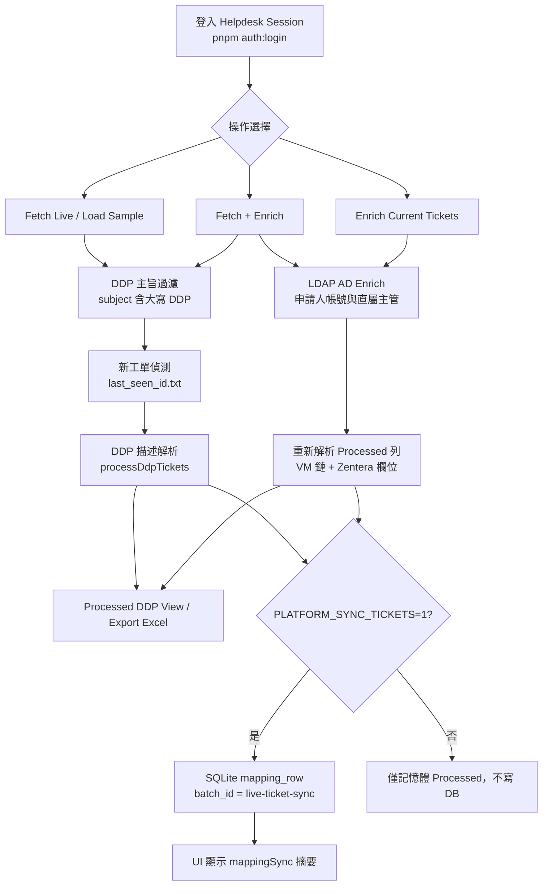
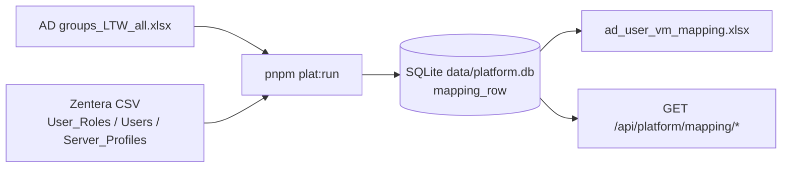
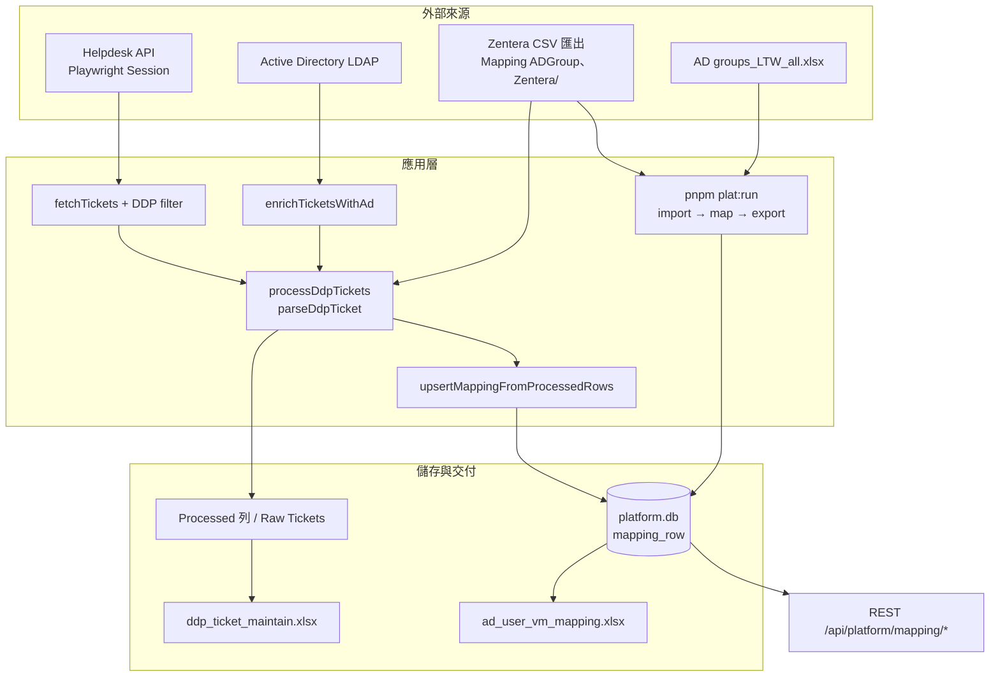

# 內部虛擬機資源映射系統 — 技術進度報告

> **對象：** 電子業 IT 部門（AD / IAM、Zentera、Helpdesk 維運、權限盤點）  
> **撰寫日期：** 2026-06-09  
> **依據：** [`docs/superpowers/`](../) 規格與計劃、現有程式碼 review  
> **相關文件：** [`PROGRESS.md`](../../PROGRESS.md) · [`helpdesk-workflow.md`](../../helpdesk-workflow.md) · [`platform-track-b-plan.md`](../plans/2026-06-03-platform-track-b-plan.md)

---

## 摘要

本專案將兩條既有營運鏈整合為可重跑、可追溯的內部系統：

1. **工單線（Track A）** — 從 Helpdesk 擷取 DDP 虛擬機申請工單，解析描述、LDAP 補齊身分、對照 Zentera 產出 Processed 檢視與維護用 Excel（`ddp_ticket_maintain.xlsx`）。
2. **映射線（Track B）** — 將 AD 群組 × Zentera 角色 × VM 主機的盤點規則產品化，以 SQLite `mapping_row` 取代 notebook + 手動總表（`ad_user_vm_mapping.xlsx`），並支援工單驅動的增量更新。

**一句話：** 取票即可看描述解析結果；點 **Enrich** 才串完整 AD + Zentera VM 授權鏈；**Fetch + Enrich** 還會把結果寫入映射總表並在 UI 顯示同步摘要。

---

## 零、系統界面預覽（草稿，絕不會用於最終成品）

![[Pasted image 20260609130705.png]]
### 0.1 主頁面
- Row Count：顯示總行數
- 技術員：指定只看指派給特定技術員的報案
- State file：存放用於自動登入用的狀態文件的地址
- 功能按鈕
	- Fetch
		取得工單資訊
	- Fetch + enrich
		直接取得工單+後續 DDP 需要的補充資料（例如該用戶對應的虛擬主機）

![[{C812F4E1-9217-421E-969B-0000404802CE}.png]]
![[Pasted image 20260609131416.png]] Processed DDP View 
## 0.2 表單呈現
##### 視圖
- Raw ticket
	顯示工單基礎資料
- Processed DDP View
	顯示經過 Enrich 後所需要的資料

## 一、系統流程總覽

### 1.1 工單營運主流程（Helpdesk Web）

**操作差異（匯報用語）：**

| 按鈕 | 行為 |
|------|------|
| **Fetch Live** | 取票 → DDP 過濾 → 解析 → Processed（**未** LDAP）→ 可寫 DB |
| **Load Sample** | 載入樣本 fixture，同上但不更新 tracker |
| **Fetch + Enrich** | 取票 → LDAP enrich → 解析（完整 VM 鏈）→ 可寫 DB |
| **Enrich Current** | 對已載入工單補 LDAP → 重算 Processed（**目前不觸發 DB upsert**，見 §五） |
| **Export Excel** | 依 Processed 列產出 `ddp_ticket_maintain.xlsx`（三 sheet） |

### 1.2 映射總表批次主流程（Track B）

**兩條線如何匯合：**

- **批次**（`source_kind=batch`）：週期性全量刷新映射基底。
- **工單**（`source_kind=ticket`，`batch_id=live-ticket-sync`）：每次 Fetch / Fetch+Enrich 後增量 upsert。
- **讀取優先序（B7.5）**：Enrich 查 Role/Application 時，同帳號 + VM 先查 ticket 列，再查 batch 列（需 `USE_PLATFORM_MAPPING_DB=1`）。

---

## 二、欄位一覽

本章一次說清：**取票後立即可見**、**Enrich 後才補齊**、**Excel 刻意留空**、**僅映射總表** 四類欄位。  
契約來源：[`mapping-export-schema.json`](../fixtures/mapping-export-schema.json)。

### 2.1 工單脈絡欄位（Fetch 即有，與 Enrich 無關）

| 欄位 | Processed / Excel | 獲取方式 |
|------|-------------------|----------|
| Ticket ID | ✅ / ✅（工單專用欄） | Helpdesk API |
| 工單狀態 / Status | ✅ / ✅ | Helpdesk API |
| Subject / Requester | ✅ / — | Helpdesk API |
| New（新工單標記） | ✅ / — | `last_seen_id.txt` tracker（Live fetch） |
| NB Hostname | ✅ / ✅ | 工單 `short_description` 正則解析 |
| VM Hostname（描述已填時） | ✅ / ✅ | 同上；無效 placeholder → `invalid-vm-hostname` |
| 異常（部分） | flags / Excel 紅底 | 如 `missing-nb-hostname` |

### 2.2 身分欄位 — Fetch 可推測、Enrich 才準確

| 欄位 | Excel 表頭 | **未 Enrich** | **Enrich 後** |
|------|------------|---------------|---------------|
| AD Account | AD Account | 描述 `Account name` / 帳號標籤；requester 僅在與描述一致時採用 | LDAP `sAMAccountName`（優先） |
| AD Name | AD Name (Chinese Name) | 描述中文名 | LDAP `displayName` |
| FirstName / LastName | FirstName / LastName | 中文名拆分，或 `First.Last` 帳號規則 | 同上規則，輸入來自 LDAP |
| Mail | Mail | 描述或 `{adAccount}@deltaww.com` | LDAP mail，空則預設網域 |
| BU | BU | 通常空 | LDAP `extensionAttribute2` |

**申請人帳號優先序**（[`vm-lookup-and-identity.md`](../specs/2026-06-02-vm-lookup-and-identity.md)）：

1. LDAP enrich 的 `ticket.ad`
2. 描述 + requester 合併（對齊 legacy Python）
3. 無 mail 時套用 `@deltaww.com` 預設

### 2.3 VM 與 Zentera 欄位 — Enrich 的關鍵增量

| 欄位 | Excel 表頭 | **未 Enrich** | **Enrich 後** |
|------|------------|---------------|---------------|
| VM Hostname（描述未填） | VM HostName | 空 → `missing-vm-hostname` | 申請人**直屬主管** `managerAccount` → Zentera `User_Roles` → `Server_Profiles` Hostname |
| （多 VM） | — | — | 字母序取第一筆 → `ambiguous-vm-hostname` |
| Role | Role | 描述已有 VM 時，可從 hostname 推 2 碼（notebook 規則） | Zentera CSV；或 `USE_PLATFORM_MAPPING_DB=1` 讀 published `mapping_row` |
| Application | Application | 空 | Zentera `Server_Profiles` |
| User Roles | User Roles | 空 | 主管（或申請人）在 Zentera 的角色清單 |

**VM 解析順序**（[`resolveVmHostname.ts`](../../../server/ddp/resolveVmHostname.ts)）：

1. 描述內有效 VM hostname → 採用  
2. 否則：LDAP 主管帳號 → Zentera 索引查 VM  
3. 全無 → `missing-vm-hostname`

### 2.4 Excel 延伸欄（表頭存在、工單流暫空）

| 欄位 | Excel 表頭 | 現況 | 備註 |
|------|------------|------|------|
| Group Owner | Group Owner | 固定預設 `G-Delta-rollout_admin` | 契約 `ticketExportDefault` |
| Group Name | Group Name | 空 | 待資料源 |
| NAS Folder Name | NAS Folder Name | 空 | 平台 V1 可編輯白名單 |
| NEW VM | NEW VM | 空 | 同上 |
| Template Name | Template Name | 空 | 同上 |
| Location | Location | 空 | 同上 |
| Host IP | —（工單表無） | 僅映射總表匯出 | 決策 D-TICKET-01 |
| BG | —（工單表無） | 映射總表 / DB | 批次盤點用 |

### 2.5 工單專用欄（不在映射總表）

| 欄位 | 說明 |
|------|------|
| 異常 | Processed `abnormalFlags` → Excel 紅底「檢查」+ Helpdesk 超連結 |
| Abnormal Flags（UI） | `missing-ad-account`、`missing-nb-hostname`、`invalid-vm-hostname`、`missing-vm-hostname`、`ambiguous-vm-hostname` |

### 2.6 映射總表 19 欄（`ad_user_vm_mapping.xlsx`）

與工單表共用 `mappingFieldId` 的欄位，經 [`serializeTicketMappingCells`](../../../platform/export/ticketWorkbookMapping.ts) 與平台匯出同一套 transform。  
工單 Processed 列經 `upsertMappingFromProcessedRows` 寫入 `mapping_row`（鍵：`(ad_account, vm_hostname, nb_hostname)` + `source_kind=ticket`）。

### 2.7 UI 可觀測摘要欄（非業務列）

Fetch / Fetch+Enrich 成功後，`processedSummary` 可能包含：

| 欄位 | 說明 |
|------|------|
| `newTicketCount` / `abnormalRowCount` | Processed 統計 |
| `trackerWarning` | 新工單 tracker 異常（非致命） |
| `adSummary` | LDAP 成功/失敗計數（Enrich 路徑） |
| `adWarning` | Enrich 失敗但取票仍成功 |
| `mappingSync` | DB upsert：`attempted` / `upserted` / `skipped` / `error`（B7.6 / REQ-PLAT-009） |

---

## 三、資料流與獲取方式

### 3.1 總覽圖

### 3.2 來源對照表

| 資料類型 | 來源系統 | 觸發時機 | 落地 |
|----------|----------|----------|------|
| 原始工單 | Helpdesk REST（session 由 Playwright 維護） | Fetch Live / Fetch+Enrich | UI Raw Tickets |
| AD 屬性 | LDAP | Enrich / Fetch+Enrich | `ticket.ad` → Processed 身分欄 |
| VM / Role / Application | Zentera CSV 內嵌索引 | 每次 `processDdpTickets`；**VM 鏈需 LDAP 主管帳號** | Processed + Excel |
| 映射（批次） | AD xlsx + Zentera CSV | `pnpm plat:run` | `mapping_row`（batch） |
| 映射（工單增量） | Processed 列 | `attachProcessedPayload`（Fetch / Fetch+Enrich） | `mapping_row`（ticket） |
| 工單 Excel | Processed + 契約 serializer | Export Excel / `workflow:ddp` | 本機 xlsx |
| 映射 Excel | DB + 契約 serializer | `plat:run --output` | `ad_user_vm_mapping.xlsx` |

### 3.3 環境變數

| 變數 | 預設 | 作用 |
|------|------|------|
| `DATABASE_URL` | `file:./data/platform.db` | SQLite 路徑 |
| `PLATFORM_SYNC_TICKETS` | `1` | `0` 關閉工單 → DB upsert 與 `mappingSync` |
| `USE_PLATFORM_MAPPING_DB` | 未設 | `1` 時 Enrich 優先讀 published `mapping_row` |

見 [`config/platform.example.env`](../../../config/platform.example.env)。

### 3.4 關鍵程式路徑

| 模組 | 職責 |
|------|------|
| `server/fetchProcessAndEnrich.ts` | 編排 fetch → enrich（可選）→ process → DB sync |
| `server/ddp/parseDdpTicket.ts` | 單筆工單 → Processed 列 |
| `server/zentera/resolveZenteraExportFields.ts` | Role / Application / UserRoles |
| `platform/sync/upsertMappingFromProcessed.ts` | 工單 → `mapping_row` |
| `platform/export/serializeMappingRow.ts` | 契約驅動匯出 |
| `server/excel/buildDdpExcelRows.ts` | 工單 Excel 列建構 |

---

## 四、與原始需求對照

### 4.1 產品定位（[`platform_requirements_draft.md`](../../../Mapping%20ADGroup%E3%80%81Zentera/docs/platform_requirements_draft.md)）

| 原始痛點 | 現況 |
|----------|------|
| notebook 重跑成本高 | `pnpm plat:run` + SQLite pipeline ✅ |
| 規則隱含難審計 | `mapping-export-schema.json` 單一契約 ✅ |
| 缺乏批次版本 | `batches` / published-archived ✅ |
| 產出僅報表 | REST API 查詢 published 列 ✅ |
| 工單與總表脫節 | 工單增量 upsert + enrich 讀取優先序 ✅ |

### 4.2 Helpdesk 工單線（Track A spec 索引）

| Spec | 交付狀態 |
|------|----------|
| [`2026-05-22-helpdesk-ticket-preview-design.md`](../specs/2026-05-22-helpdesk-ticket-preview-design.md) | ✅ Live/Sample 取票 |
| [`2026-05-28-helpdesk-ad-enrichment-design.md`](../specs/2026-05-28-helpdesk-ad-enrichment-design.md) | ✅ LDAP enrich |
| [`2026-05-29-helpdesk-ddp-enrich-workflow-design.md`](../specs/2026-05-29-helpdesk-ddp-enrich-workflow-design.md) | ✅ DDP 過濾、Fetch+Enrich |
| [`2026-05-29-helpdesk-processed-ddp-view-design.md`](../specs/2026-05-29-helpdesk-processed-ddp-view-design.md) | ✅ Processed View、tracker |
| Phase 2A VM/身分 | ✅ [`vm-lookup-and-identity.md`](../specs/2026-06-02-vm-lookup-and-identity.md) |
| Phase 2B Zentera 匯出欄 | ✅ Role/Application/UserRoles |
| Phase 3 CI / workflow | ✅ `workflow:ddp`、helpdeskVitePlugin |
| Phase 4 營運 | 🟡 SharePoint CLI、排程腳本已交付；合併待確認 |

---

## 五、開發進度與 Code Review 結果

### 5.1 里程碑時間軸

| 日期 | 交付 |
|------|------|
| 2026-05-22～28 | 取票、LDAP、UI 基礎 |
| 2026-05-29 | Processed DDP View、描述解析、新工單 tracker |
| 2026-05-30～31 | Zentera VM 查詢鏈、申請人身分規則 |
| 2026-06-02 | Excel 匯出、Phase 2A/2B/3 合併 master、Phase 4 啟動 |
| 2026-06-03 | Track B 規格、`mapping-export-schema.json`、B0–B7 實作 |
| 2026-06-09 | 本報告；B7.6 UI 已部分落地 |

### 5.2 Track A — 工單 Web（REQ 摘要）

| ID | 需求 | 狀態 |
|----|------|------|
| REQ-VM-001 | VM 查詢鏈（申請人 → 直屬主管 → Zentera） | ✅ Phase 2A |
| REQ-ID-001 / 002 | 申請人帳號優先序、姓名規則 | ✅ |
| REQ-EXL-001 | Excel Role/Application/UserRoles | ✅ Phase 2B |
| REQ-EXL-002 | 異常與 Processed flags 一致 | ✅（含 Zentera 缺 VM） |
| REQ-EXL-003 | NAS/Template/Location 留空 | ✅ 刻意留空 |
| REQ-AD-001 / 002 | AD 亂碼、missing-ad 旗標 | 🟡 個案待查 |
| REQ-ENG-001 | CI push/PR | ⬜ |
| REQ-OPS-001 / 003 | SharePoint、workflow、排程 | ✅ CLI/腳本；D4 串接待決 |

### 5.3 Track B — 映射平台（REQ 摘要）

| ID | 需求 | 狀態 | 備註 |
|----|------|------|------|
| REQ-PLAT-001 | `mapping_row` DB | ✅ | migration = 契約 `dbColumn` |
| REQ-PLAT-002 | 匯入 + 正規化 + join pipeline | ✅ | `pnpm plat:run` |
| REQ-PLAT-003 | 匯出契約 + serializer + golden | ✅ | B0 |
| REQ-PLAT-004 | 映射 xlsx/csv 匯出 | ✅ | B4 |
| REQ-PLAT-005 | Published batch API | ✅ | B5 |
| REQ-PLAT-006 | 工單匯出共用 `mappingFieldId` | ✅ | B6 |
| REQ-PLAT-007 | 工單 Processed → upsert | ✅ | B7.1–B7.4 |
| REQ-PLAT-008 | SQLite 唯一正式 DB | ✅ | |
| REQ-PLAT-009 | `mappingSync` 可觀測性 | 🟡 | 見 §5.4 |

**Track B 計劃勾選：** B0–B7.5 ✅；B3.5 `mapping_exceptions`、B3.7 xlsx diff ⬜；B7.6 文件 checkbox 未同步更新。

### 5.4 Code Review 重點發現

#### 已實作（B7.6 階段 1 大部分）

- 後端：`attachProcessedPayload` 產生 `processedSummary.mappingSync`（[`fetchProcessAndEnrich.ts`](../../../server/fetchProcessAndEnrich.ts)）。
- 前端：`App.vue` metrics band 顯示 `Synced upserted/attempted`；`mappingSync.error` 以 warning band 呈現。
- 測試：`tests/fetchProcessAndEnrich.test.ts` 覆蓋 sync 成功 / 失敗 / `PLATFORM_SYNC_TICKETS=0`。

#### 缺口與風險

| # | 項目 | 嚴重度 | 說明 |
|---|------|--------|------|
| R1 | **Enrich Current 不寫 DB** | 中 | [`enrichAdRoute.ts`](../../../server/ad/enrichAdRoute.ts) 僅 `rebuildProcessedPayload`，未呼叫 `attachProcessedPayload` → 手動 Enrich 後 Processed 更新但 **無 `mappingSync`、無 upsert** |
| R2 | B7.6 階段 2 `GET /api/platform/mapping/sync-status` | 低 | spec 標可選，尚未實作 |
| R3 | 測試 148/151 通過 | 低 | `platformMappingApi.test.ts` 3 例失敗（DB fixture 狀態） |
| R4 | 文件與 checkbox 滯後 | 低 | plan B7.6、backlog REQ-PLAT-009 仍標 ⬜ |
| R5 | 映射平台 UI | — | spec 明確非本迭代；僅 API + CLI |

#### 建議修復優先序（匯報後續工作）

1. **R1** — `enrich-ad` 路徑在 reprocess 後呼叫與 fetch 等價的 mapping sync（或共用 `attachProcessedPayload` 片段）。
2. **R3** — 隔離 platform API 測試 DB fixture，恢復 CI 全綠。
3. **R2** — 若維運需要不經 Helpdesk 即可查 `live-ticket-sync` 狀態，補 sync-status 端點。

### 5.5 待決策事項（利害關係人）

| # | 問題 | 建議預設 |
|---|------|----------|
| D1 | Excel 異常是否含 Zentera 缺 VM | 已實作為一致；匯報時可註明 |
| D2 | VM 鏈用直屬主管或上兩層 | 已決：直屬主管（Phase 2A spec） |
| D4 | SharePoint 是否串入 `workflow:ddp` | 目前獨立 CLI |
| — | 平台映射 CRUD UI 時程 | 另立項，依 B5 API 擴充 |

---

## 六、匯報建議用語

### 對主管（1 分鐘）

> 我們把 DDP 虛擬機申請工單和 AD–Zentera 映射總表接到同一套系統。同仁在網頁上取票就能看到解析結果；按 **Enrich** 會自動查 AD 和 Zentera 補齊 VM 與權限欄位，並可匯出維護用 Excel。映射總表已從 notebook 搬到資料庫，工單處理結果也會增量寫回總表，方便盤點與查詢。

### 對維運（操作要點）

1. 首次：`pnpm auth:login` + 確認 Zentera CSV 在 `Mapping ADGroup、Zentera/`。  
2. 日常：**Fetch + Enrich** → 檢查 Processed 與 **Mapping DB** metrics → Export Excel。  
3. 映射總表週期更新：`pnpm plat:run` → curl 驗證 `/api/platform/mapping/published`。  
4. 若只要先看描述、不查 AD：可用 Fetch Live，但 VM 鏈可能不完整。

### 已知限制（誠實揭露）

- 手動 **Enrich Current** 後，UI 不會更新映射 DB 同步摘要（R1，計劃修復）。  
- NAS / Template / Location 等交付欄位工單流仍空，需平台 UI 或新資料源。  
- 映射 CRUD 介面尚未建置，現階段以 CLI + API 為主。

---

## 七、附錄

### A. 規格文件索引

| 文件 | 用途 |
|------|------|
| [`2026-06-03-platform-mapping-db-export.md`](../specs/2026-06-03-platform-mapping-db-export.md) | 映射 DB + 匯出契約 |
| [`2026-06-03-platform-ticket-incremental-sync.md`](../specs/2026-06-03-platform-ticket-incremental-sync.md) | 工單增量 upsert |
| [`2026-06-03-platform-mapping-sync-observability.md`](../specs/2026-06-03-platform-mapping-sync-observability.md) | mappingSync 可觀測性 |
| [`2026-06-02-helpdesk-backlog.md`](../specs/2026-06-02-helpdesk-backlog.md) | REQ-* 總表 |
| [`2026-06-02-helpdesk-development-roadmap.md`](../plans/2026-06-02-helpdesk-development-roadmap.md) | 全階段路線圖 |

### B. 簡報閱讀動線（建議投影片順序）

1. 摘要 + 雙主線流程圖（§一）  
2. 欄位三層表：取票即有 / Enrich 補齊 / 留空（§二）  
3. 資料流一圖 + 環境變數（§三）  
4. 進度儀表板 + Review 缺口 + 待決策（§五）  
5. 匯報用語 + 已知限制（§六）

---

*本檔為 living draft；需求狀態變更時請同步更新 [`PROGRESS.md`](../../PROGRESS.md) 與對應 spec。*
